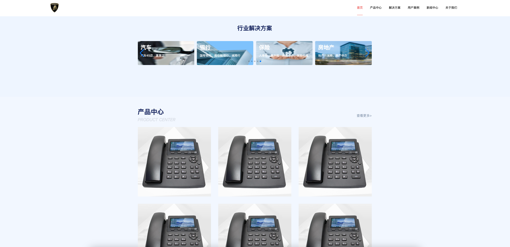

基于alone-blog二次改造，兼容手机、电脑，所有图片等媒体资源均为个人测试使用，公司名称均为虚构。

## 截图




## node v20.18.1

## Setup

Make sure to install the dependencies:

```bash
# yarn
yarn

# npm
npm install

# pnpm
pnpm install --shamefully-hoist
```

## Development Server

Start the development server on http://localhost:3000

```bash
npm run dev
```

## Production

Build the application for production:

```bash
npm run build
```

Locally preview production build:

```bash
npm run preview
```

Checkout the [deployment documentation](https://v3.nuxtjs.org/guide/deploy/presets) for more information.
